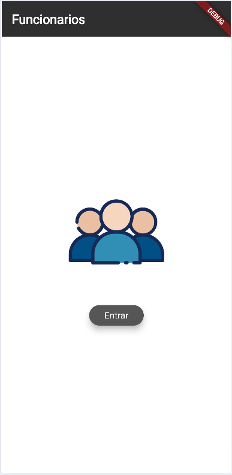
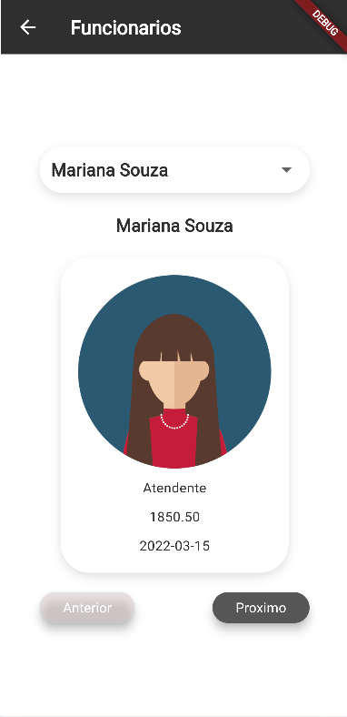
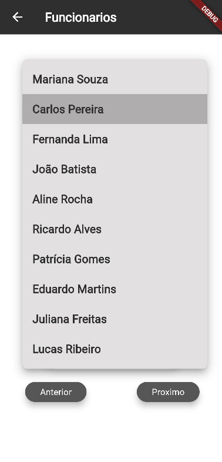

# Funcionários
Atividade do curso técnico em desenvolvimento de sistema que consistia em criar um aplicativo com flutter que renderiza uma lista de funcionários em json.

## Tecnologias
- Flutter
- Dart
- Android Studio
- VsCode

## Como testar
- Clone o repositório
- Abra com VsCode, em um terminal digite:
```
flutter pub get
flutter run
```

## Prints

||||
|:-:|:-:|:-:|
|Splash|Home|Menu|